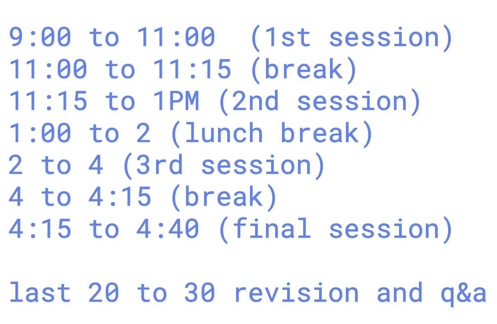

# BlueCross_Blue_Shield_21stJuly2025


## in GCP vscode  after inactive it is uninstalling az command so 

### to install it you can run given command 
```
curl -sL https://aka.ms/InstallAzureCLIDeb | sudo bash
```
### session timings 



