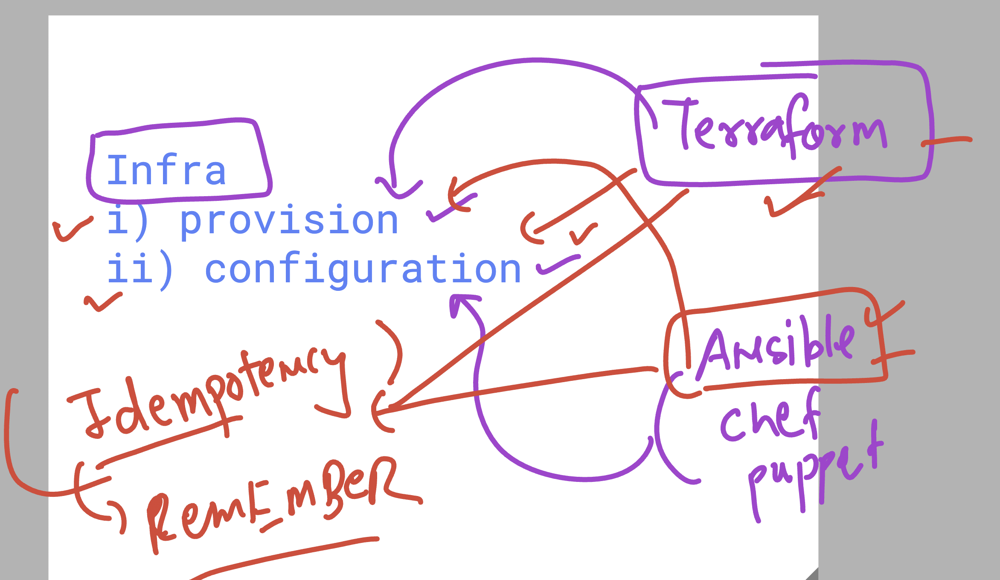
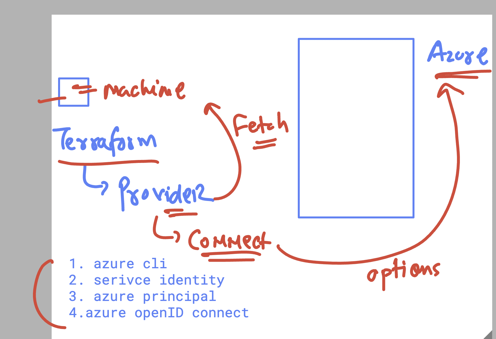

# BlueCross_Blue_Shield_21stJuly2025

### basic infra problem 


### few basic info about HashiCorp Terraform 


### terraform / ansible  use with idempotency 



## checking terraform version 

```
thexyzcompany2022@cloudshell:~ (terraform-466505)$ terraform   version 
Terraform v1.12.2
on linux_amd64
```


### terraform to azure -- authencation connection options 



## Running terraform HCL code steps 

### terraform init 

```
 cd  ashu-tf-code/
thexyzcompany2022@cloudshell:~/ashu-tf-code (terraform-466505)$ ls
provider.tf
thexyzcompany2022@cloudshell:~/ashu-tf-code (terraform-466505)$ ls -a
.  ..  provider.tf
thexyzcompany2022@cloudshell:~/ashu-tf-code (terraform-466505)$ terraform  init 
Initializing the backend...
Initializing provider plugins...
- Finding hashicorp/azurerm versions matching "4.37.0"...
- Installing hashicorp/azurerm v4.37.0...
- Installed hashicorp/azurerm v4.37.0 (signed by HashiCorp)

```

### after init 

```
ls -a
.  ..  provider.tf  .terraform  .terraform.lock.hcl

```

### terraform plan (dry-run)

```
terraform  plan 

No changes. Your infrastructure matches the configuration.

Terraform has compared your real infrastructure against your configuration and found no differences, so no changes are needed.
```

### terraform apply -- (actually create Infra)

```
terraform  apply 

No changes. Your infrastructure matches the configuration.

Terraform has compared your real infrastructure against your configuration and found no differences, so no changes are needed.

Apply complete! Resources: 0 added, 0 changed, 0 destroyed.
thexyzcompany2022@cloudshell:~/ashu-tf-code (terraform-466505)$ 

```

### to deploy 

```
terraform  apply 

Terraform used the selected providers to generate the following execution plan. Resource actions are indicated with the following symbols:
  + create

Terraform will perform the following actions:

  # azurerm_resource_group.ashu-group will be created
  + resource "azurerm_resource_group" "ashu-group" {
      + id       = (known after apply)
      + location = "eastus"
      + name     = "ashu-group-tf"
    }

Plan: 1 to add, 0 to change, 0 to destroy.

Do you want to perform these actions?
  Terraform will perform the actions described above.
  Only 'yes' will be accepted to approve.

  Enter a value: yes

azurerm_resource_group.ashu-group: Creating...
azurerm_resource_group.ashu-group: Still creating... [00m10s elapsed]
azurerm_resource_group.ashu-group: Creation complete after 14s [id=/subscriptions/ee075321-f9dd-42f2-a56a-2f0a5141d191/resourceGroups/ashu-group-tf]

```
