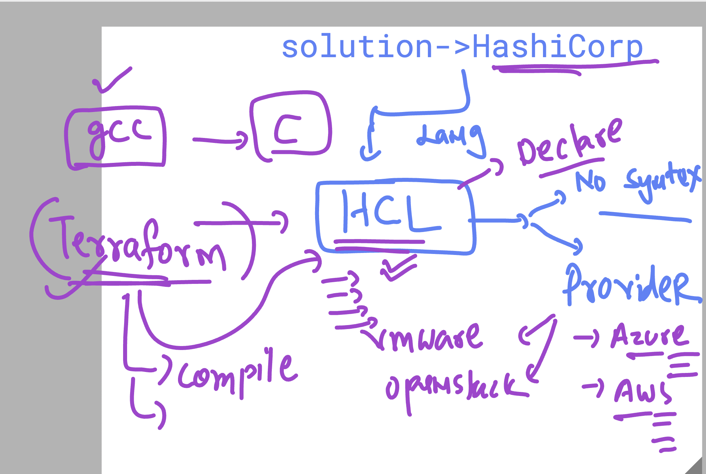

# BlueCross_Blue_Shield_21stJuly2025

### basic infra problem 


### few basic info about HashiCorp Terraform 



### terraform / ansible  use with idempotency 


## checking terraform version 

```
thexyzcompany2022@cloudshell:~ (terraform-466505)$ terraform   version 
Terraform v1.12.2
on linux_amd64
```


### terraform to azure -- authencation connection options 


