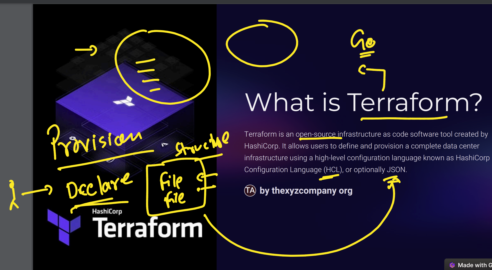
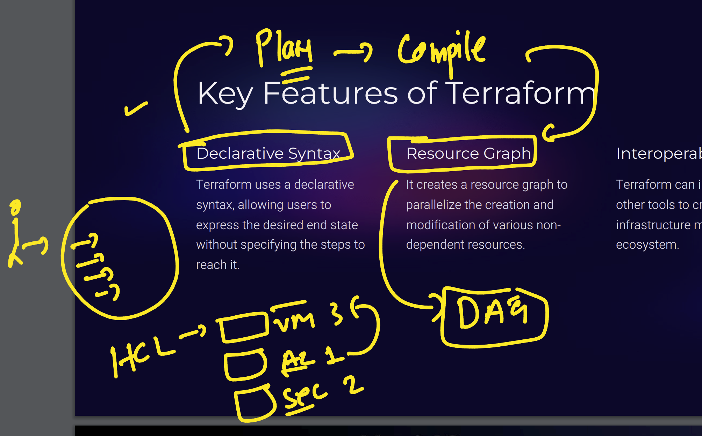

### Revision



### Resource Dependency Graph



### Installing Azure CLI

```sh
curl -sL https://aka.ms/InstallAzureCLIDeb | sudo bash
```

After installation, verify your account:

```sh
az account show
```

Example output:
```json
{
   "environmentName": "AzureCloud",
   "homeTenantId": "da228470-00d6-408f-a48b-645b4818de82",
   "id": "ee075321-f9dd-42f2-a56a-2f0a5141d191",
   "isDefault": true,
   "managedByTenants": []
}
```

## Some Important Terraform Commands

```sh
terraform init -upgrade

terraform plan

terraform plan -target=azurerm_virtual_network.ashu-example

terraform plan -target=azurerm_virtual_network.ashu-example -out=ashuvnetplan

terraform apply ashuvnetplan

terraform destroy -target=azurerm_virtual_network.ashu-example
```
