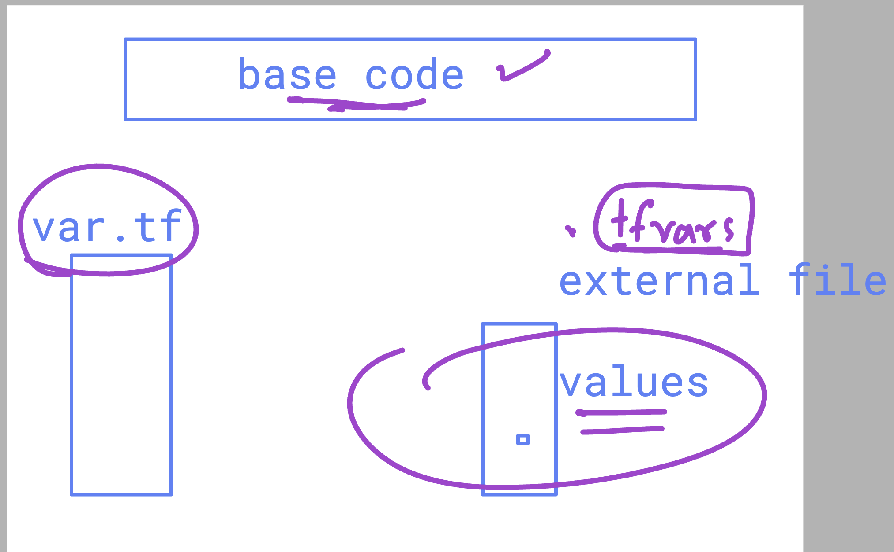
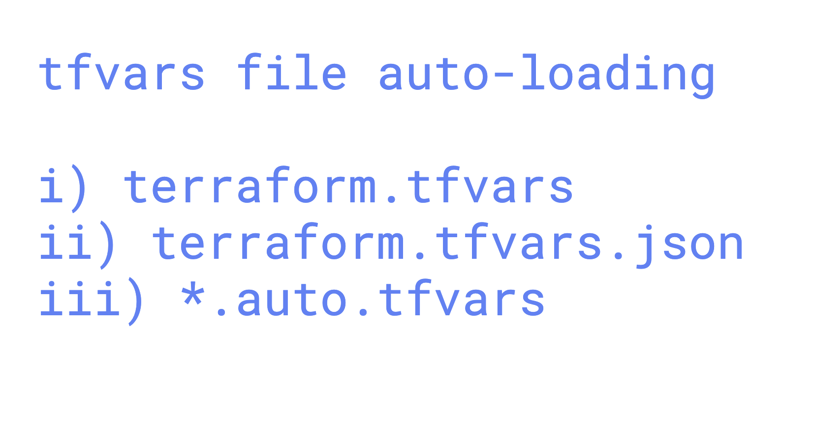

### Revision


### Resource Dependency Graph


### Installing Azure CLI

```sh
curl -sL https://aka.ms/InstallAzureCLIDeb | sudo bash
```

After installation, verify your account:

```sh
az account show
```

Example output:

```json
{
   "environmentName": "AzureCloud",
   "homeTenantId": "da228470-00d6-408f-a48b-645b4818de82",
   "id": "ee075321-f9dd-42f2-a56a-2f0a5141d191",
   "isDefault": true,
   "managedByTenants": []
}
```

## Some Important Terraform Commands

```sh
terraform init -upgrade
terraform plan
terraform plan -target=azurerm_virtual_network.ashu-example
terraform plan -target=azurerm_virtual_network.ashu-example -out=ashuvnetplan
terraform apply ashuvnetplan
terraform destroy -target=azurerm_virtual_network.ashu-example
```

### Terraform State Command Options

```sh
terraform state list
# Output:
# data.azurerm_resource_group.ashu-group
# azurerm_subnet.ashu-subnet
# azurerm_virtual_network.ashu-example

terraform state show azurerm_virtual_network.ashu-example
# Output:
# resource "azurerm_virtual_network" "ashu-example" {
#     address_space = ["172.16.0.0/16"]
#     ...
# }
```

### Passing Variable Values Inline or via Prompt

If not defined in `var.tf` file, you can pass default values inline:

```sh
terraform plan -var="ashu_rsg=ashu_day2_rsg"
terraform plan -var="ashu_rsg=ashu_day2_rsg" -var="ashu_rsg_location=eastus"
```

## concept of storing variable with their values in tfvars file 




```
terraform  plan  -var-file=ashu_val.tfvars
 terraform  apply  -var-file=ashu_val.tfvars
```

### more info about tfvars in terraform 

