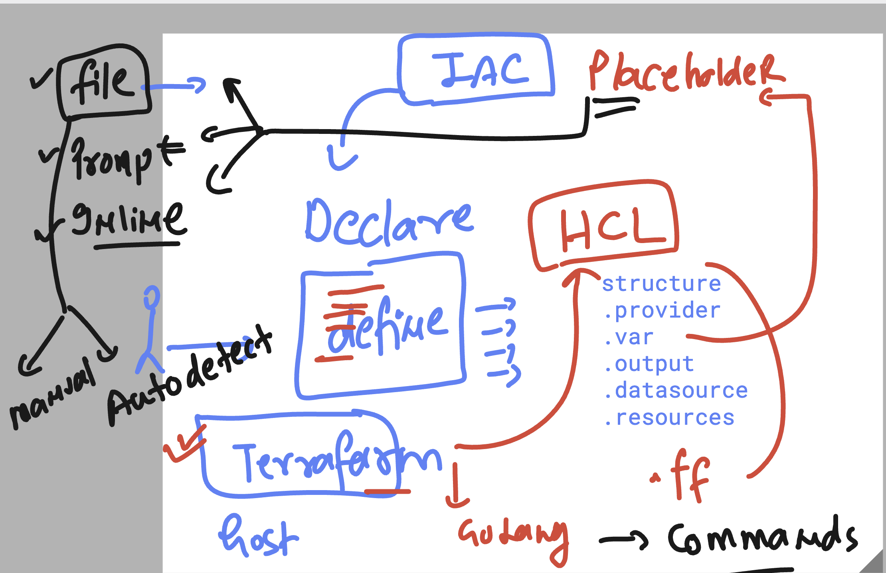
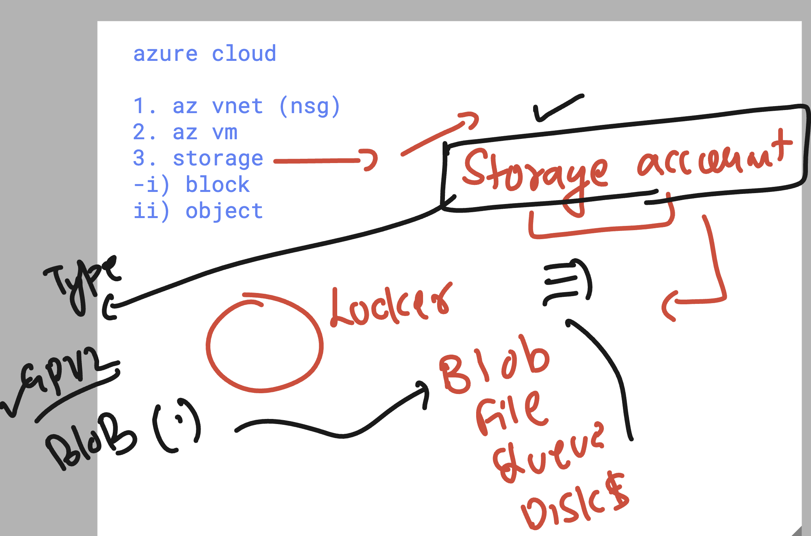

# BlueCross_Blue_Shield_21stJuly2025

### Basic revision 



### verify az login session 

```
az account show
{
  "environmentName": "AzureCloud",
  "homeTenantId": "da228470-00d6-408f-a48b-645b4818de82",
  "id": "ee075321-f9dd-42f2-a56a-2f0a5141d191",
  "isDefault": true,
  "managedByTenants": [],
  "name": "Azure subscription 1",
  "state": "Enabled",
  "tenantDefaultDomain": "delvex.io",
  "tenantDisplayName": "Delvex Innovations Pvt Ltd",
  "tenantId": "da228470-00d6-408f-a48b-645b4818de82",
  "user": {
    "name": "ashutoshh@delvex.io",
    "type": "user"
  }
}
thexyzcompany2022@cloudshell:~ (terraform-466505)$ terraform  version 
Terraform v1.12.2
on linux_amd64

```

## info about storage account 



### directory structure of tf code 

```
hexyzcompany2022@cloudshell:~ (terraform-466505)$ tree ashu-tf-day3/
ashu-tf-day3/
├── output.tf
├── provider.tf
├── storage.tf
└── var.tf

```

## terraform fmt -- to format code structure in beautify way

```
terraform fmt 
```