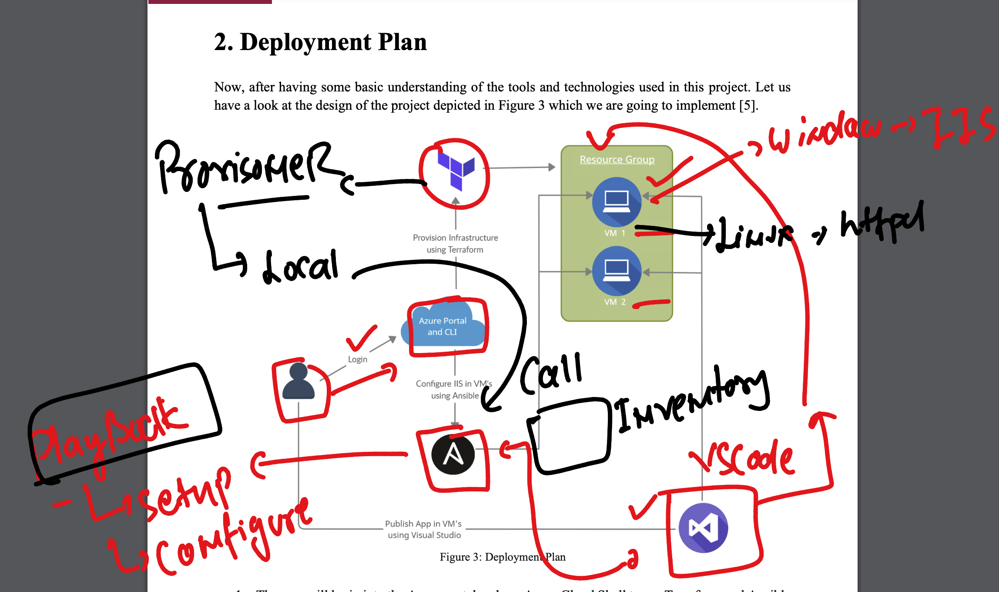
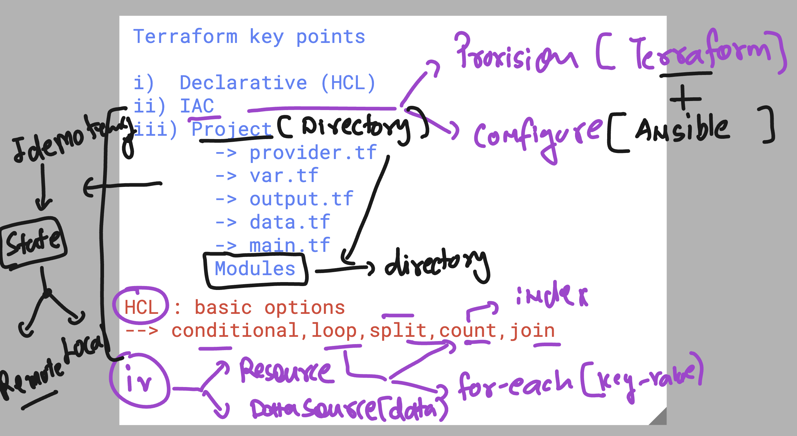
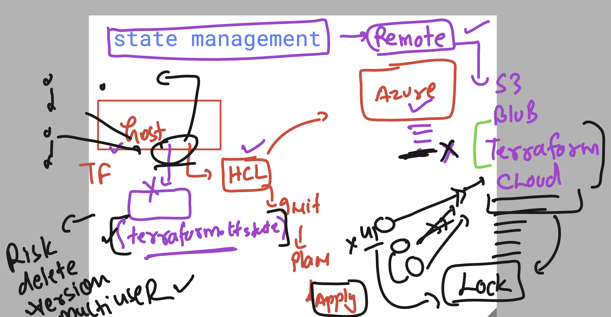

# BlueCross_Blue_Shield_21stJuly2025

### Terraform + ansible  understanding of usages



### terraform overall revision 



## verify lab ENV 

```
thexyzcompany2022@cloudshell:~$ terraform  version 
Terraform v1.12.2
on linux_amd64
thexyzcompany2022@cloudshell:~$ az version 
{
  "azure-cli": "2.75.0",
  "azure-cli-core": "2.75.0",
  "azure-cli-telemetry": "1.1.0",
  "extensions": {}
}
thexyzcompany2022@cloudshell:~$ az account show 
{
  "environmentName": "AzureCloud",
  "homeTenantId": "da228470-00d6-408f-a48b-645b4818de82",
  "id": "ee075321-f9dd-42f2-a56a-2f0a5141d191",
  "isDefault": true,

```

## understanding terraform.tfstate  Remote management 



## some fix 

```
337  rm -rf .terraform*
  338  ls
  339  terraform init 
  340  terraform plan 
  341  terraform apply --auto-approve 
```